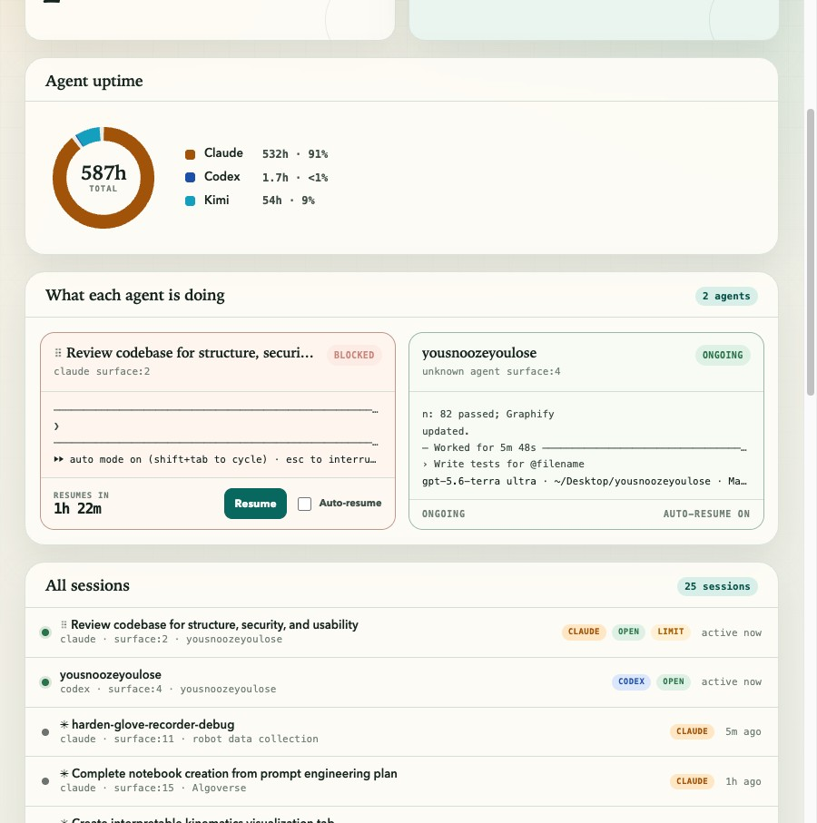

# YouSnoozeYouLose (ysyl)

[](https://github.com/emersony99/yousnoozeyoulose/actions/workflows/ci.yml)
[](https://www.python.org/downloads/)
[](LICENSE)

YouSnoozeYouLose is a lightweight Python daemon that watches Claude Code and Kimi
sessions running inside [cmux](https://cmux.com) surfaces, detects usage /
rate-limit blocks, parses the reset time, and automatically resumes the agent
once the quota refreshes — so a limit that hits while you're away doesn't cost
you the rest of your session.

It ships with a **local Recovery Desk dashboard** so you can see exactly what it's
locked onto and choose what gets auto-resumed.



## How it works

1. Every few seconds it lists cmux surfaces and keeps only the ones that look
   like agents — cmux tags wrapped Claude panes with `resume_binding.kind`, and
   titles/commands are matched as a fallback.
2. It reads the **live tail** of each agent surface (not the whole scrollback,
   which avoids false positives from an agent merely *discussing* rate limits)
   and runs the Claude/Kimi detectors.
3. On a detected block it parses the reset time (`reset at 3pm (America/New_York)`,
   `resets in 5 hours`, `retry after 300s`, …) and sleeps until then. The
   scheduler is resilient to laptop sleep — it wakes correctly even if the wall
   clock jumps.
4. At reset it types **`resume`** into the agent surface and presses Enter,
   then verifies on the next poll that the limit actually cleared. If it didn't,
   it backs off and retries, up to a configurable cap. The action is configurable
   per agent kind via `agent_resume_actions`.

The dashboard header has a **History** dropdown to switch between keeping 3 days, 1 week (default), or 3 weeks of session history without editing a config file.

## Requirements

- **macOS** with the [cmux](https://cmux.com) app installed (this is where the
  agent sessions live).
- **Python 3.11+**.

## Install

Install the `ysyl` CLI with [pipx](https://pipx.pypa.io) (recommended — keeps it
isolated and on your PATH):

```bash
pipx install git+https://github.com/emersony99/yousnoozeyoulose.git
```

Or with pip:

```bash
pip install git+https://github.com/emersony99/yousnoozeyoulose.git
```

Or from a local clone (editable, for development):

```bash
git clone https://github.com/emersony99/yousnoozeyoulose.git
cd yousnoozeyoulose
pip install -e '.[dev]'
```

> **Run it inside a cmux terminal.** cmux only accepts control from terminals
> inside the app by default, so launch `ysyl run` from a cmux tab (or see
> [Troubleshooting](#troubleshooting) to allow external access). Run `ysyl doctor`
> if anything looks off.

## Usage

Run the daemon (dashboard on http://127.0.0.1:8765 by default):

```bash
ysyl run
```

Stop every running YSYL daemon owned by the current user:

```bash
ysyl stopall
```

Override the polling interval, scheduler tick, dashboard port, or state file:

```bash
ysyl run --interval 10 --tick 30 --ui-port 8765 --state ~/.ysyl/state.json
ysyl run --no-ui            # headless
```

Inspect tracked surfaces or dismiss one from the CLI:

```bash
ysyl status
ysyl dismiss <surface_id>
```

Diagnose cmux connectivity (run this if the daemon reports socket errors):

```bash
ysyl doctor
```

## Troubleshooting

Run **`ysyl doctor`** first — it reports the cmux binary, whether you're inside a
cmux surface, the socket control mode, the live vs. inherited socket, and a
connectivity verdict with a tailored fix.

**`Failed to write to socket (Broken pipe)`.** cmux's `automation.socketControlMode`
defaults to **`cmuxOnly`**, which only accepts control from terminals **inside the
cmux app**. If you launched `ysyl` from a normal macOS Terminal/iTerm, cmux drops
the connection. Two fixes:

- **Simplest — run ysyl inside cmux.** Open a terminal tab in the cmux app and run
  `ysyl run` there. It watches your other surfaces. No config changes.
- **Run from an external terminal.** Allow socket control in cmux:
  1. Edit `~/.config/cmux/cmux.json` (back it up first):
     ```json
     "automation": { "socketControlMode": "password", "socketPassword": "<pick-one>" }
     ```
  2. `cmux reload-config`
  3. `export CMUX_SOCKET_PASSWORD=<the-password>` then `ysyl run` (ysyl forwards it
     via `--password`). Use `"allowAll"` instead for no-password local access.

**`cmux: command not found`.** ysyl auto-resolves the binary from cmux's env vars,
PATH, and the install path, so this is rare; if it happens, set
`YSYL_CMUX_BIN=/full/path/to/cmux`.

ysyl also pins every call to the **live** socket (via cmux's `last-socket-path`)
and retries transient drops, so a stale `CMUX_SOCKET_PATH` from a cmux restart is
handled automatically.

Dump a surface's current text (useful for tuning detectors against a real limit
banner):

```bash
ysyl capture <surface_id>            # writes to ~/.ysyl/captures/
ysyl capture <surface_id> --stdout
```

### Debugging

When a surface is misclassified or auto-resume isn't doing what you expect, turn
on debug mode:

```bash
ysyl run --debug   # or set YSYL_DEBUG_MODE=true
```

In debug mode ysyl:

- Captures the tail of every agent surface on every poll to `~/.ysyl/captures/`.
- Logs the inferred agent kind and which detector matched.
- Logs the exact resume action (Enter / text) sent to each surface.

Inspect the latest capture to see exactly what the daemon sees:

```bash
ls -lt ~/.ysyl/captures | head
ysyl capture <surface_id> --stdout
```

The most common misclassification is a Claude Code session whose conversation
happens to mention Kimi (or vice-versa). ysyl now prefers cmux's
`resume_binding.kind` when available, so a wrapped Claude pane is never scanned
by the Kimi detector.

## The dashboard

`ysyl run` serves a localhost-only page listing every agent surface cmux knows
about, not just the blocked ones. Blocked rows show a live **resume-in** countdown,
retry count, text preview, **Armed** toggle, and **Dismiss** / **Resume now**
buttons. Healthy rows show `watching` so you can tell the daemon is actually alive
and scanning your sessions.

## Configuration

Settings come from environment variables (prefixed `YSYL_`) or a `.ysyl.toml` in
the current or home directory. Useful keys:

| Key | Default | Purpose |
|-----|---------|---------|
| `poll_interval_seconds` | `10` | Seconds between surface polls |
| `auto_arm` | `true` | Newly-detected blocks auto-resume unless you toggle them off |
| `agent_resume_actions` | `{"claude":"text:resume","kimi":"text:resume"}` | Per-agent resume: `'enter'` or `'text:<string>'` |
| `resume_action` | `enter` | Fallback when agent kind is not in `agent_resume_actions` |
| `resume_text` | `continue` | Fallback text when fallback action is `text` |
| `max_retries` | `5` | Resume attempts before a surface is auto-dismissed |
| `tail_lines` | `30` | How many trailing lines are scanned for a banner |
| `agent_title_patterns` | `["claude","kimi","role:"]` | Substrings that mark a surface as an agent |
| `capture_on_detect` | `false` | Capture surface text on every detection |
| `debug_mode` | `false` | Capture every agent poll and log detector decisions |
| `detector_banner_patterns` | `{}` | Extra regexes appended per agent kind |
| `history_window` | `1w` | Keep session history: `3d`, `1w`, or `3w`. Also editable in the dashboard. |
| `prune_resumed_after_hours` | `168` | Advanced override for `history_window` |
| `prune_dismissed_after_hours` | `168` | Advanced override for `history_window` |
| `resume_verify_delay_seconds` | `1.0` | Wait this long after a resume keystroke before re-reading |
| `ui_enabled` / `ui_host` / `ui_port` | `true` / `127.0.0.1` / `8765` | Dashboard |

Because real limit wording changes, the detectors are best-effort and
**capture mode** logs surface text (to `~/.ysyl/captures/`) whenever a banner is
seen but the reset time can't be parsed — collect those samples and add exact
patterns via `detector_banner_patterns` without touching the code.

## Development

```bash
pip install -e '.[dev]'
pytest
```
